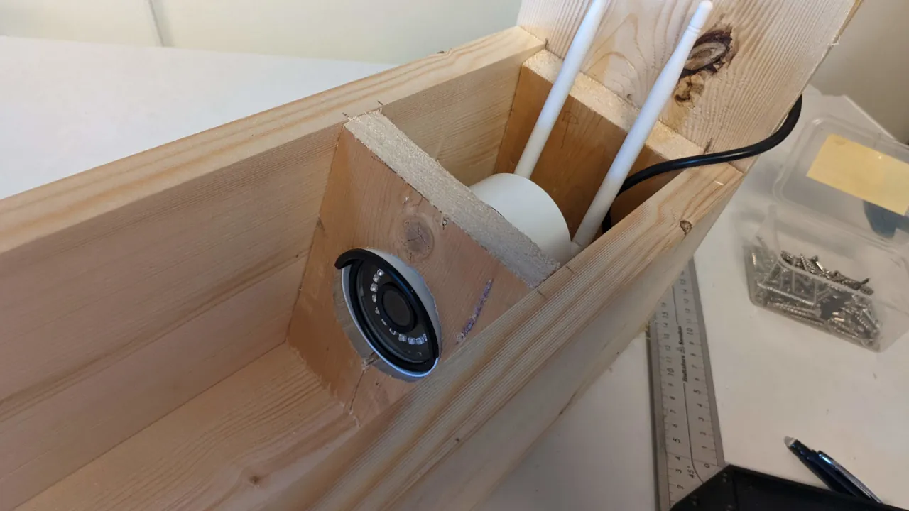
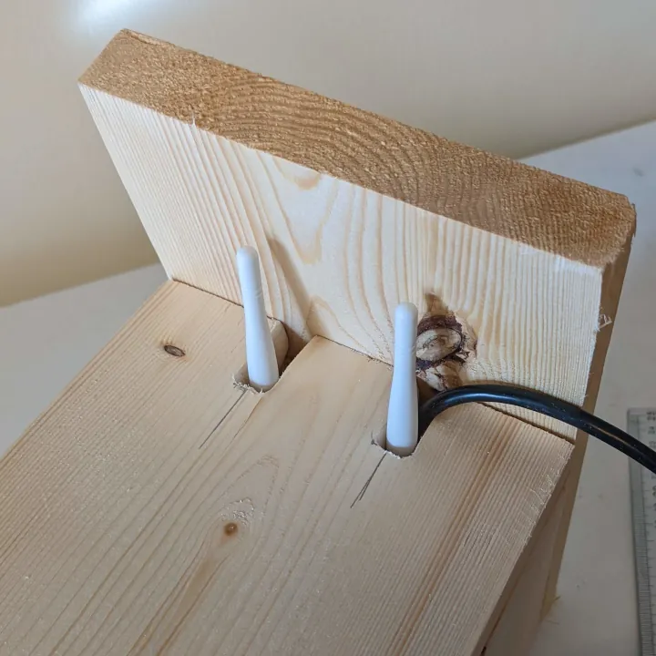

+++
author = "Jonatan Holmgren"
title = "Planning for Birdbox 2022"
date = "2022-03-26"
description = "This year we're buying off-the-shelf."
cover = "render.png"
categories = [
    "Birdbox"
]
tags = [
    "birdbox",
]
+++
This year we're going with the Reolink RLC-410W as our main camera, connected with Wifi and to the power grid. We hope that this means this will be a 0 maintenance operation, but I think I just jinxed it. Here's a picture of the birdbox from the building process:

As you probably see the antennas are rather big, that's why we decided to make holes like this:

Bye for now.
Jonte.