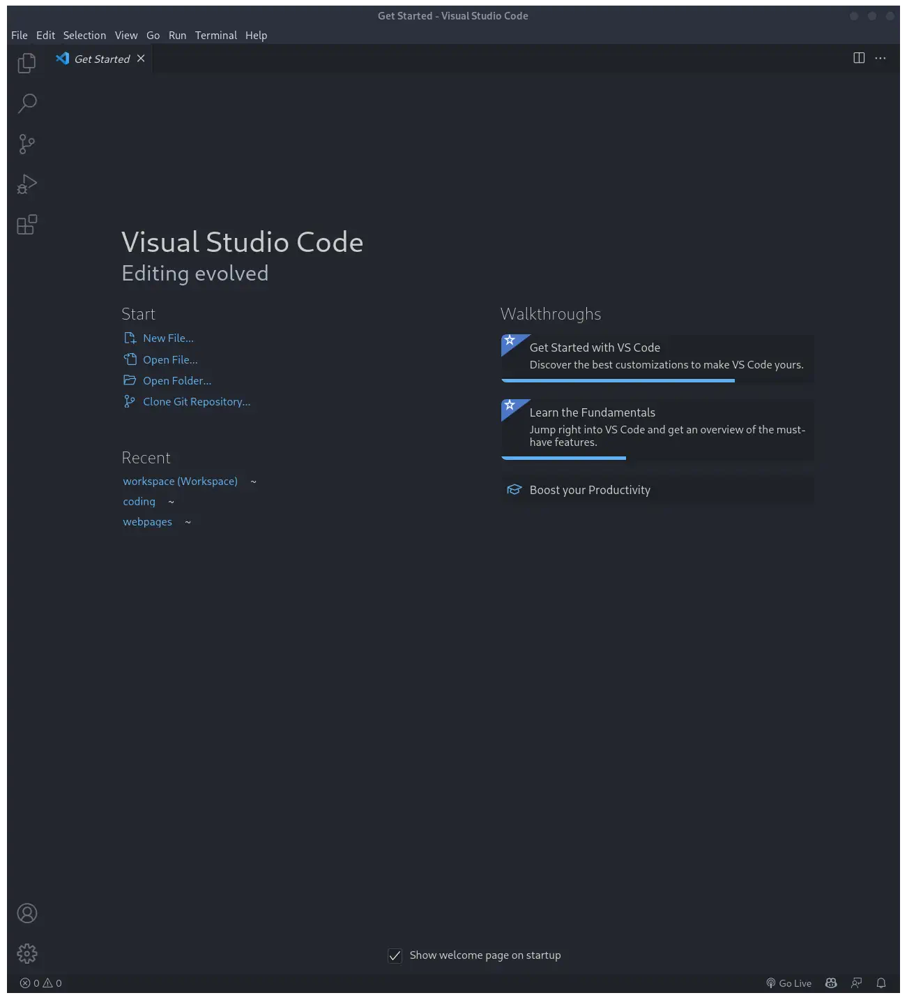

+++
author = "Jonatan Holmgren"
title = "VSCode with Python. It's great."
date = "2022-04-25"
description = "A Linux Python Tutorial with Screenshots"
categories = [
    "Linux"
]
tags = [
    "linux",
]
+++
## Installing VSCode
Installing VSCode is really easy. Either download from your software center, or via [code.visualstudio.com](https://code.visualstudio.com). Then start the program. It should look something like this.

## Writing the first program
Click "New File", and create an empty text document saved as `example.py` somewhere. Now print "Hello World". It should look like this:

## Installing the Python Extension for VSCode
You see that little window telling you to install Python in the far bottom corner? Click `install`. If that's not an option, click on the building blocks icon to the left of the screen, and then install Python. 
## Changing the version
Let's look in the far bottom right corner. To change the version of Python, click the number to the right of "Python", which probably for you is 3 point something. Now click it. You might only get Python 3 in the popup, this means you do not have Python 2 installed. If you want to use that as well, be sure to run install that first. To do that, install the package most likely called `python-2`, on Debian based systems that would be `sudo apt install python-2`. Now you can switch version.

## BUT HOW DO I RUN THE CODE?!?!
You see that icon with the arrow and bug? Click it.

Then click "Run and Debug" Done.
## Conclusion
Python is cool.

- Jonte